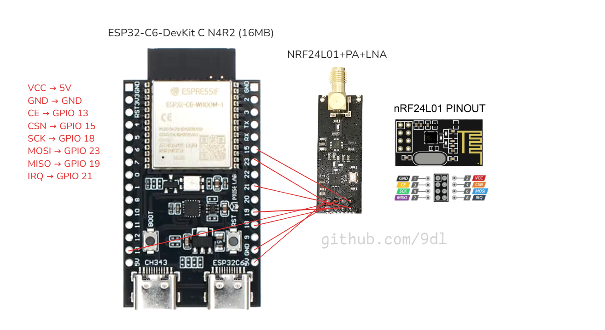

# ESP32 C6 - nRF24L01 Module

This tutorial will guide you through setting up the **ESP32 C6** and connecting it to the **nRF24L01** module.

---

## 🛠️ Materials Required

- **ESP32 C6 DevKit**
- **nRF24L01 Module**
- **Jumper wires**
- **Breadboard**
- **10uF Capacitor** (rated above 5V, recommended for stability)

---

## 🔌 Wiring for ESP32 C6 and nRF24L01

The following table outlines the wiring for the **nRF24L01** module to the **ESP32 C6**:

| **nRF24L01 Pin** | **ESP32 C6 Pin** | **Notes**                    |
|------------------|------------------|------------------------------|
| **VCC**          | **5V**            | **Do not** use 3.3V for nRF24L01 |
| **GND**          | **GND**           | Ground connection            |
| **CE**           | **GPIO 13**       | Chip Enable pin              |
| **CSN**          | **GPIO 15**       | Chip Select Not pin          |
| **SCK**          | **GPIO 18**       | Serial Clock pin             |
| **MOSI**         | **GPIO 23**       | Master Out Slave In pin      |
| **MISO**         | **GPIO 19**       | Master In Slave Out pin      |
| **IRQ**          | **GPIO 21**       | Interrupt Request pin (optional) |

---

## 📦 Steps

### 1. Wiring the nRF24L01 to ESP32 C6:
Follow the wiring in the table above.

### 2. Upload the Example Code:
- Open **`example.ino`** in Arduino IDE or your preferred IDE.
- Upload the code to your **ESP32 C6**.

### 3. Running the Code:
- The code will initiate communication with the **nRF24L01** module.
- You should see debug output on your serial monitor.

---

## 📐 Wiring Diagram

---

- [ESP32 C6 Code for nRF24L01](example.ino)
- [Go Back to Main README](../README.md)