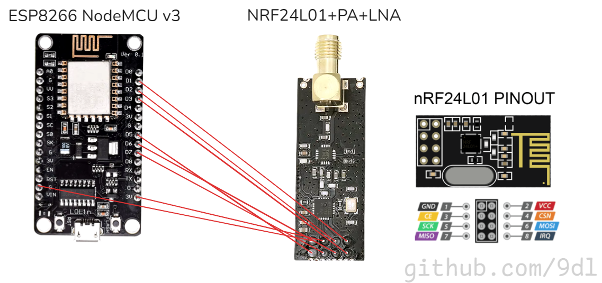

# ESP8266 - Wi-Fi Deauther and Fake Access Points

This section covers using the **ESP8266** for network security testing projects, including a **Deauther** to perform Wi-Fi deauthentication attacks and **Fake Wi-Fi Access Points** to simulate multiple fake networks.

## 🛠️ Materials Required

- **ESP8266 DevKit** (e.g., NodeMCU)
- **Jumper wires** (if using external modules)
---

### 📘 Project 1: Wi-Fi Deauther

A deauther tool disconnects devices from a Wi-Fi network by sending deauthentication packets, useful for testing network security and resilience.

- **Link**: [deauther.com](https://deauther.com/)

---

### 📘 Project 2: Multiple Fake Wi-Fi Networks

This script creates up to **10 fake Wi-Fi networks** that will remain active until the device is powered off. It’s a tool for simulating Wi-Fi environments with multiple networks for testing.

- **Code**: [fake_wifis.ino](fake_wifis.ino)
- **Code**: [fake_wifis_nrf24.ino](fake_wifis_nrf24.ino) *for using it with nRF24 Antenna
- **Usage**: Flash to the ESP8266, adjust network names and count as desired, and run.

---

---

### 🔌 Wiring for ESP8266 NodeMCU v3 and nRF24L01+PA+LNA

If you're using the **ESP8266 NodeMCU v3** and the **nRF24L01+PA+LNA** module, here's the recommended wiring:

| nRF24L01+PA+LNA Pin | ESP8266 NodeMCU v3 Pin | Notes                            |
|----------------------|----------------------|----------------------------------|
| **VCC**              | **3.3V**             | **Do not** use 5V for the nRF24L01+PA+LNA. |
| **GND**              | **GND**              | Common ground connection.        |
| **CE**               | **D2 (GPIO 4)**      | Changeable; defined in code.     |
| **CSN**              | **D1 (GPIO 5)**      | Changeable; defined in code.     |
| **SCK**              | **D5 (GPIO 14)**     | Serial Clock for SPI.            |
| **MOSI**             | **D7 (GPIO 13)**     | SPI MOSI (Master Out Slave In).  |
| **MISO**             | **D6 (GPIO 12)**     | SPI MISO (Master In Slave Out).  |
| **IRQ**              | **D3 (GPIO 0)**          | Optional, used for interrupts if needed. |

### 📦 Additional Notes:
- **Capacitor**: A **10uF** capacitor (rated above 5V) between **VCC** and **GND** on the nRF24L01 module can help with power stability.
- **Antenna**: The NodeMCU uses an onboard PCB antenna, which is sufficient for most applications. For longer range, consider models like **ESP8266-07** or **ESP8266-12** with an external antenna connector.

---

## 📐 Wiring Diagram

---

- [Go Back to Main README](../README.md)
